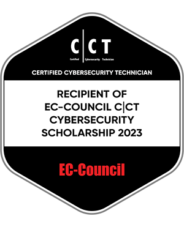
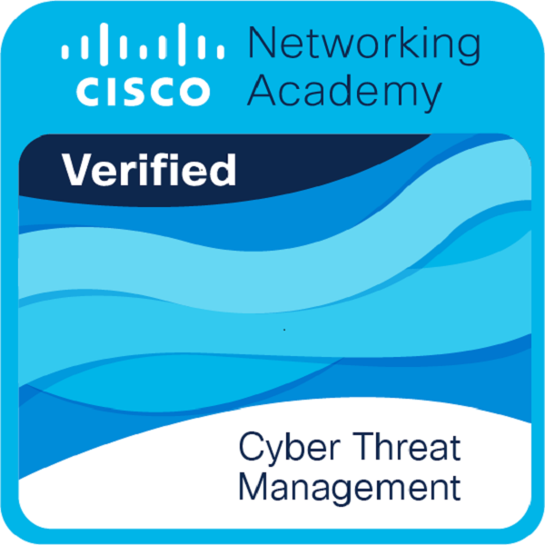
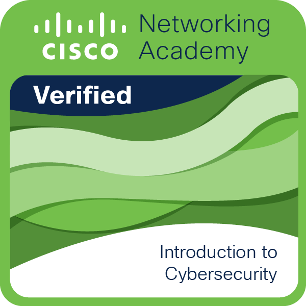
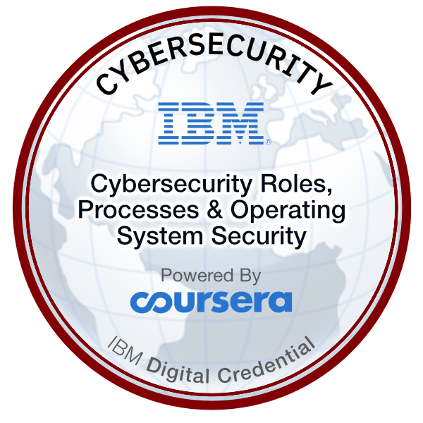

# Hello, I'm Halil Ibrahim Deniz!

## About Me

Hello, my name is Halil Ibrahim. I am 23 years old and a high school graduate. 
I am currently building my career in the fields of cybersecurity and programming. 
As a blog writer, I publish five articles on my website every week, and I share one open-source project on my GitHub account every week. 
I am actively improving my English skills while also learning German.

## 🌐 Socials:

 
 
 

## Skills

### Cybersecurity

#### Network Security

- Network security is one of the most important topics in cybersecurity. I'm trying to specialize in network security to keep my network safe.
- My network security skills include fundamental topics such as secure encryption protocols, secure network configuration, and firewalls. I can also perform network security tests using different tools like network scanners, port scanning tools, and network analysis tools.

#### Cybersecurity Tools

- I'm constantly trying to improve myself by using different tools used in cybersecurity. These tools include various tools such as Nmap, Metasploit Framework, Wireshark, and Kali Linux.
- By simulating different cyber attack scenarios using these tools, I can test defense mechanisms and improve network security.

### Programming

#### Python Programming

- Python is one of the programming languages I know the best. I'm highly skilled in software development using this language and have developed solutions for many different projects using Python.
- My Python skills include different topics such as data structures, functions, object-oriented programming, GUI programming, and web development. I also work on different areas such as artificial intelligence, data science, and machine learning using Python.

#### C++ Programming

- C++ is one of my favorite programming languages for software development. Since I started developing software in this language, I'm constantly trying to improve my C++ skills.
- My C++ skills include fundamental topics such as data structures, algorithms, memory management, and object-oriented programming. I also work on different areas such as game development using C++.

### Hardware

#### Microcontroller Programming

- Microcontroller programming is one of my favorite areas of expertise in hardware. In this area, I mainly work on platforms such as Arduino and Raspberry Pi.

## Interests

- Learning foreign languages: Learning languages is an important hobby for me. Currently, I'm improving my English and learning German. I also plan to learn other languages in the future.
- Knowledge Sharing: I always like to share the information I learn on my website called [DenizHali](https://denizhalil.com) with people in the most descriptive way.

# 📊 GitHub Stats:

## Launguages

## Technologies

## Badges
 

crposs.png
## Certificates
I have achieved the following certificates:
- [CompTIA Pentest+ Learning Path Certificate](https://tryhackme-certificates.s3-eu-west-1.amazonaws.com/THM-WJJBPULUUZ.png)
- [Web Fundamentals Learning Path Certificate](https://tryhackme-certificates.s3-eu-west-1.amazonaws.com/THM-B9TDMJ2WEX.png)
- [Complate Beginner Learning Path Certificate](https://tryhackme-certificates.s3-eu-west-1.amazonaws.com/THM-3MEB4WAZ49.png)
- [Jr Penetration Tester Learning Certificate](https://tryhackme-certificates.s3-eu-west-1.amazonaws.com/THM-LIGW7HCEYJ.png)
- [Introduction to Cyber Security Certificate](https://tryhackme-certificates.s3-eu-west-1.amazonaws.com/THM-IPRMSN7E9Q.png)
- [Red Teaming Learning Path Certificate](https://tryhackme-certificates.s3-eu-west-1.amazonaws.com/THM-NCWCUV3KS8.png)
- [Pre Security Learning Path Certificate](https://tryhackme-certificates.s3-eu-west-1.amazonaws.com/THM-QUUCHXZJGP.png)
- [Cyber Defense Learning Path Certificate](https://tryhackme-certificates.s3-eu-west-1.amazonaws.com/THM-ALYOXGPUMY.png)

## Contact

- Email    : halildeniz313@gmail.com
- Linkedin : https://www.linkedin.com/in/halil-ibrahim-deniz/
- TryHackMe: https://tryhackme.com/p/halilovic
- Instagram: https://www.instagram.com/deniz.halil333/
- YouTube  : https://www.youtube.com/c/HalilDeniz
- Mysite   : https://denizhalil.com/

  ## 💰 You can help me by Donating
   
   

  
